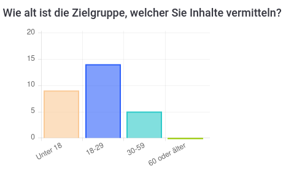

# Presentation May

## Dataset

## Overview

## Survey

**We are currently evaluating our 30+ responses!**

## What is the goal?

We want to derive an explanation from the decision of the DNN. This explanation should be visualized in an human centric way.

## Next steps:

* Evaluate the survey
* Implement a first version of the DNN
* Decide how we want to visualize the explanaition for the decision of the DNN (based on survey)
* Implement explanation algorithm